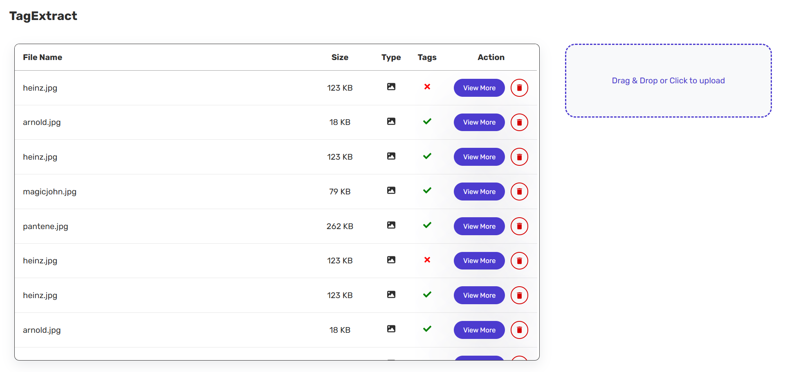
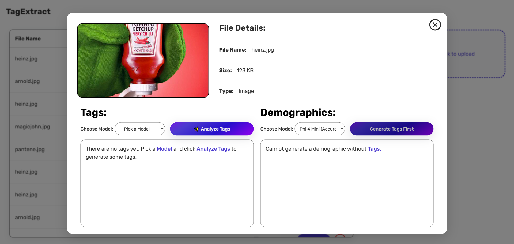
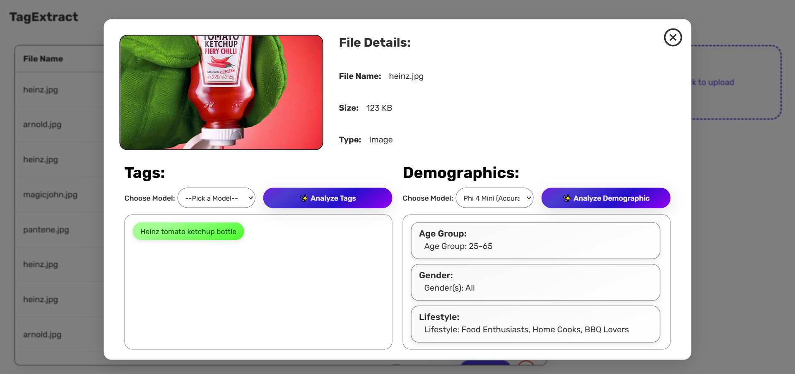
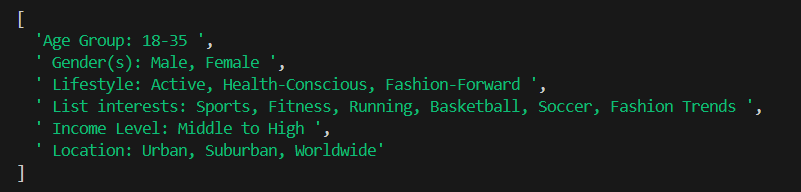

# Tag Extract

## Overview
TagExtract extracts tags from advertisements, which are images or videos, tries to find out what the product is and recommends the demographic information of the person likely to be interested in this product. The main goal is to increase conversions by finding out the right audience for a particular advertisement. It does this using a combination of ML Models.

## Workflow:
- Upload the image or video
- Click "View More" to open a modal
- Pick a model and analyze tags
- Pick a model and analyze demographics

## Tech Stack:
- Frontend: ReactJS, Axios
- Backend: NodeJS, ExpressJS
- Database: PostgreSQL
- Machine Learning: PyTorch, HuggingFace

## Images:
This is the upload page. Drag and drop or click on the uploads section to insert a file.

This is the Modal that opens up when you click "View More".

This is the modal with the Tags and Demographics generated.

This is a console.log() statement of all the demographics that are generated as an array, which is the output of the model running in phillm.py

## Models Used:
Models used for Image tag generation: ViT, Florence 2 (Dense Caption Region)
Models used for Video tag generation: ViViT, Florence 2 (Dense Caption Region) applied on relevant frames of the video.
Model used for Demographic generation: Phi-4-mini-instruct

